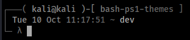
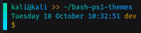
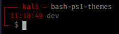
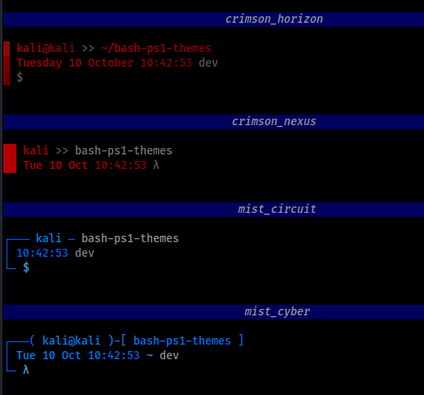
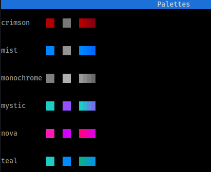

<h1 align="center">
  Bash Prompt Themes :rainbow: 
</h1>

<p align="center">
Bash prompt themes, with a color gradient feature.
</p>
<p align="center">
  
  
  
</p>


# How to use

Themes are a combination of a template and a color palette. The template is the prompt itself and the colors from the palette are applied onto it.

Theme names are a combinasion of their template and palette: `template_palette` like `teal_horizon`.

## Demo the themes

Demo all the themes using:

```bash
./demo_themes
```


## Use a theme

To use a theme simply source it to your current shell:

```bash
source ./themes/teal_horizon
```

## Persistent use
Clone the repo on your machine because themes aren't fully standalone, they use the `lib/lib` file from this repo. 

Source the theme in your `.bashrc`. For instance, at the end of your `.bashrc`, add: 
```bash
# Change the path with where you put bash-ps1-themes
source ~/bash-ps1-themes/themes/teal_cyber_3
```
# How it works

The themes work with the PROMPT_COMMAND and PS1 environment variable. 

The PROMPT_COMMAND invokes a function that in turn invokes other functions to build a PS1 variable.

# Development

You can create your own templates and color palettes.

## Palette development

### Creating a palette

Create a new file in the `palettes/` folder and update the following variables to your liking:

```bash
#!/bin/bash
palette_primary="#1bcfc6"
palette_primary_dark="#02a199"
palette_secondary="#008cff"
palette_secondary_dark="#0066ba"
palette_accent="#b88914"
palette_accent_dark="#9c7f0c"
palette_gradient_start="#0bb092"
palette_gradient_end="#008cff"
palette_variant_1="#00d7af"
palette_variant_2="#00d7d7"
palette_variant_3="#00d7ff"
palette_text="#d2d2d2"
```

### Viewing a palette

To preview the palette in the terminal, use:

```bash
./demo_palettes
```


```bash
./demo_palettes --detailed
```


## Template development

### Creating a template

Create a new file in the `templates/` folder.

This snippet is an example of a basic template:

```bash
#!/bin/bash
scriptDir=$(dirname -- "$(readlink -f -- "$BASH_SOURCE")")
source $scriptDir'/../lib/lib'

prompt_cmd() {
  LINE_1="$(rgb_fg_ps1 $palette_primary)$(current_user) $(rgb_fg_ps1 $palette_secondary)$(basename $PWD)"
  LINE_2="$(rgb_fg_ps1 $palette_accent)$ $(rgb_fg_ps1 $palette_text)"

  PS1="\r\n${LINE_1}\r\n${LINE_2}"
}

export PROMPT_COMMAND='prompt_cmd'
```

### Lib API

Here are some functions you can use in your templates:
```bash
# Set the foreground color, all text set after calling this function will be the desired color
rgb_fg_ps1 "#ffffff" 

# Set the background color, all text set after calling this function will be the desired color
rgb_bg_ps1 "#ffffff" 

# Create a foreground gradient over a defined string
fg_gradient_ps1 "#ff0000" "#00ff00" "some string to receive gradient"

# Create a background gradient over a defined string
bg_gradient_ps1 "#ff0000" "#00ff00" "some string to receive gradient"

# Current git branch
gitbranch
```

See the lib/ source for more functions.

## Generating the themes from your new palette/template

Then, to apply the palette to the templates, there is a `generate_themes` script that combines all sets of templates and palettes together:
```bash
./generate_themes
```

Your theme will be generated in the `themes/` folder.

# Notice
Works only in Bash shells.
